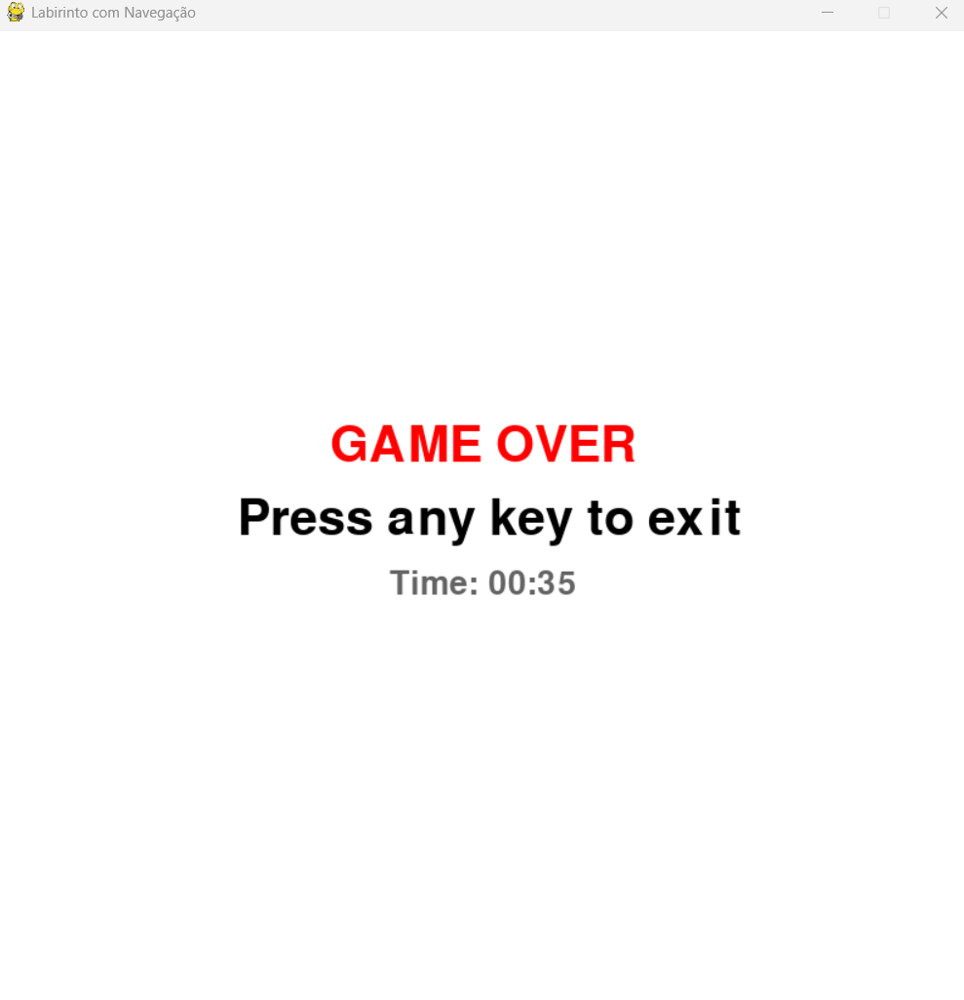

# Labirinto com Dijkstra

**Número da Lista**: 2 
**Conteúdo da Disciplina**: Grafos 

## Alunos
|Matrícula | Aluno |
| -- | -- |
| 211042327  |  Carlos Gabriel Cardoso Ramos |
| 202016604  |  João Lucas Miranda de Sousa |

## Sobre
Este é um jogo interativo de labirinto em Python utilizando `pygame`, onde o labirinto é gerado com o algoritmo de Kruskal e a navegação é guiada com base nas distâncias calculadas pelo algoritmo de Dijkstra.

## Funcionalidades

- Geração de labirinto usando conjuntos disjuntos (Disjoint Set / Union-Find).
- Cálculo das menores distâncias até o destino com Dijkstra.
- Seta vermelha indica o melhor caminho.
- Setas azuis indicam caminhos que não levam diretamente ao objetivo.
- Interface gráfica com movimentação do jogador.

## Screenshots

## Requisitos

- Python 3.10 ou superior
- `pygame`

## Instalação :  

   Clone o repositório
   cd Grafos2_labirinto_dijkstra
   Use make para instalar e executar:

   make run
   Isso irá:

   Criar um ambiente virtual .venv

   Instalar as dependências listadas em requirements.txt

   Iniciar o jogo
## Uso
   Use as teclas de seta do teclado para mover o jogador.

   O jogo termina ao alcançar a célula de destino (vermelha).
